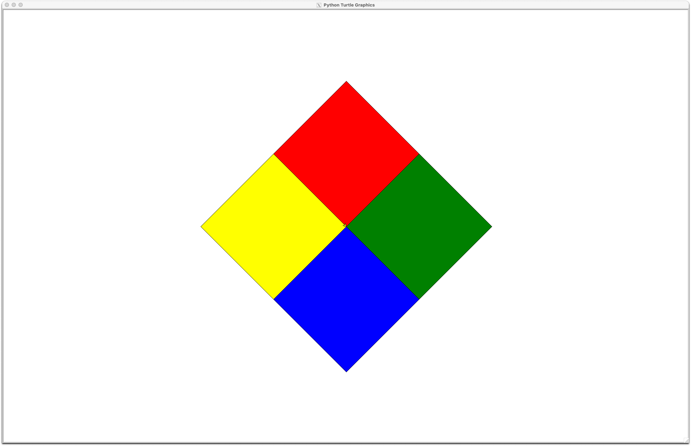

# CSM2170-Lab02

 

## P01: Day of the Week

Complete [P01DayOfTheWeek](P01DayOfTheWeek.py) so that the program
asks the user for a number in the range of 1 through 7. The program
should display the day of the week with the following correspondence:

1. Monday
2. Tuesday
3. Wednesday
4. Thursday
5. Friday
6. Saturday
7. Sunday

The program should display the error message
`The number entered is not in the range 1 to 7.`
if the user enters a number that is outside the range of 1
through 7.

Your program must have a function named `day_of_week` that takes in
an `int` and returns a `str` of the day the `int` represents. If the
or value is outside the correct range it Should return the `str`
`"Error"`.

This project is based on Chapter 3 Programming Exercise 1.

## P02: Areas of Rectangles

Complete the program [P02AreasOfRectangles](P02AreasOfRectangles.py) so that it
prompts the user for the width and height of two rectangles. It should then tell
the user which rectangle has the greater area or if the areas are the same. If
the first rectangle is larger the output should be:

> The first rectangle is larger.

If the second rectangle is larger the output should be:

> The second rectangle is larger.

If the area is the same then the output should be:

> The rectangles have the same area.

This project is based on Chapter 3 Programming Exercise 2.

## P03: Time Calculator

Complete the program [P03TimeCalculator](P03TimeCalculator.py) so that it prompts
the user to enter a number of seconds and produces a result as follows:

* There are 60 seconds in a minute. If the number of seconds entered is less than
  60 then the result is `s second(s)` where `s` is the number of seconds entered.
* There are 3600 seconds in an hour. If the number of seconds is less than 3600
  then the result is `m minute(s) and s second(s)` where `m` is the number of minutes
  and `s` is the number of seconds the time entered represents.
* There are 86400 seconds in a day. If the number of seconds is less than 86400
  then the result is `h hour(s), m minute(s), and s second(s)` where `h` is the
  number of hours, `m` is the number of minutes, and `s` is the number of seconds
  the time entered represents.
* If the number of seconds is greater than or equal to 86400 then the result is
  `d day(s), h hour(s), m minute(s), and s second(s)` where `d` is the number of
  days, `h` is the number of hours, `m` is the number of minutes, and `s` is the
  number of seconds the time entered represents.

This project is based on Chapter 3 Programming Exercise 15. Hint: Remember the
time converter from Chapter 2. The calculations are the same here just with cases
to decide what is part of the result. Use named constants (i.e. no magic numbers).

## P04: Leap Year

Complete the program [P04LeapYear](P04LeapYear.py) so that it prompts
the user to enter a year as a positive number and prints a message detailing if
that year is a leap year. Use the following criteria to identify leap years.

* If the year is less than 1 then the result is `Year must be positive.`
* Determine whether the year is divisible by 100. If it is, then it is a leap year
  if and only if it is also divisible by 400. For example, 2000 is a leap year, but
  2100 is not.
* If the year is not divisible by 100, then it is a leap year if and only if it
  is divisible by 4. For example, 2008 is a leap year, but 2009 is not.

If the year is a leap year, the result is `That year is a leap year.` If the year
is not a leap year, the result is `That year is not a leap year.`

This project is based on Chapter 3 Programming Exercise 16.

## P05: Number of Roots

The number of real roots of a quadratic polynomial $a x^2 + b x + c$, where
$a \neq 0$, can be found by inspecting its discriminant:

$$b^2 - 4 a c$$

* If the discriminant is 0, then there is 1 real root.
* If the discriminant is positive, then there are 2 real roots.
* If the discriminant is negative, then there is 0 real roots.

Complete the program [P05NumberOfRoots](P05NumberOfRoots.py) so that it prompts
the user to enter the coefficients (as floats) of a quadratic polynomial and then
prints how many real roots the quadratic has. If the user enters 0 for $a$ then
print an error message and stop (i.e. do not print anything more than the error
message). You must complete the function `number_of_roots` so that it returns the
number of roots for the given quadratic polynomial.

## P06: What is my Grade

Complete the program [P06WhatIsMyGrade](P06WhatIsMyGrade.py) so that it prompts
the user to enter their CSM 2170 Exam 1, Exam 2, Final, Lab, and Participation
grades and then prints their final average (rounded to 2 decimal places) and
letter grade. Use the grading system from our class syllabus.

## P07: What do I Need on the Final

Complete the program [P07WhatDoINeedOnTheFinal](P07WhatDoINeedOnTheFinal.py) so
that it prompts the user to enter their CSM 2170 Exam 1, Exam 2, Lab, and
Participation grades and then prints what is the minimum score on the final
needed to receive an A, B, C, and D. If it is not possible to earn a given
letter grade output `Not Possible`. If any grade on the final exam will exceed
a given letter grade, output `0.00` for the needed final exam grade (i.e. do not
output negative final grades). Use the grading system from our class syllabus.

Here are two examples of my solution running:
<pre>
Enter Exam 1 grade: 80
Enter Exam 2 grade: 65
Enter Lab grade: 80
Enter Participation grade: 80
Grade | Score on Final Exam
------+--------------------
   A  | Not Possible
   B  | 87.50
   C  | 54.17
   D  |  4.17

Enter Exam 1 grade: 100
Enter Exam 2 grade: 90
Enter Lab grade: 95
Enter Participation grade: 100
Grade | Score on Final Exam
------+--------------------
   A  | 76.67
   B  | 43.33
   C  | 10.00
   D  | 0
</pre>

## P08: Turtle Boxes

Complete the program [P08TurtleBoxes](P08TurtleBoxes.py) so that it draws the
following picture.

Note you can pick colors you like as long as I can see them. Think about how you
can use a function to help draw the boxes (i.e. make a function to draw one box
and then call it 4 times). That said I will not take points off for having
repeated code in this project. This will not be true for later labs, so it is
good to practice now. Be sure you image stays open until it is clicked closed.
Note this project does not have an automated test.

## Coding Style

Your code is not only graded by the automated tests. I will run more tests on
your code and review your code and commits. You are expected to follow good
programming conventions (see [Lab01](https://github.com/EIU-Computer-Science/CSM2170-Lab01)
for more details). Failure to do so will
impact your grade for an assignment. In particular, your code should pass the
linter checks, files should start with a docstring summarizing the project and
giving the names of the team members, and all functions should have a docstring
detailing their behavior.

## Submit your work by pushing it to GitHub

Commit your changes often (at least once per program, but likely many more
times for larger programs). Push when you are done with your work for the
day or have code that you want your partner or me to see. Until you push
your commits, they will only be on your local machine. Note that the
automated tests will run when you push as well. I will grade the last push
to the main branch that is done before the deadline. Commits or pushes done
after the deadline will receive no credit. Check that you can see your code
on GitHub before the deadline.

