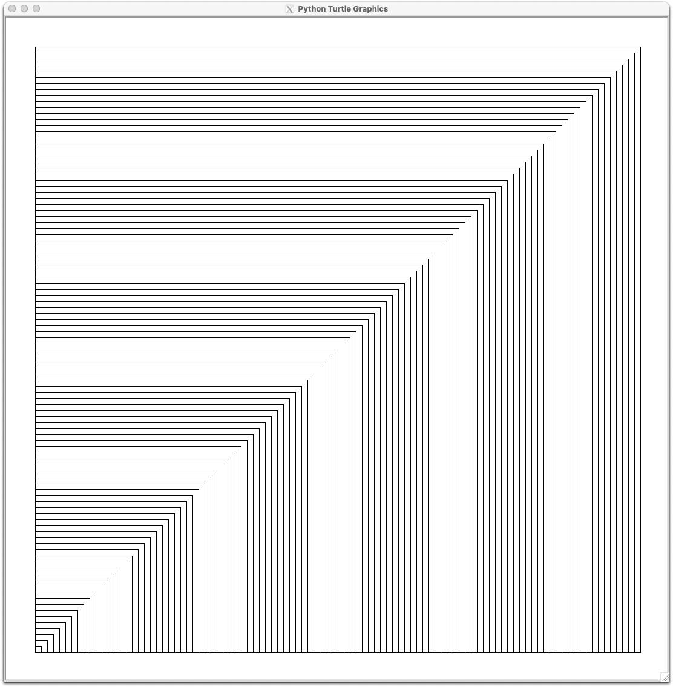
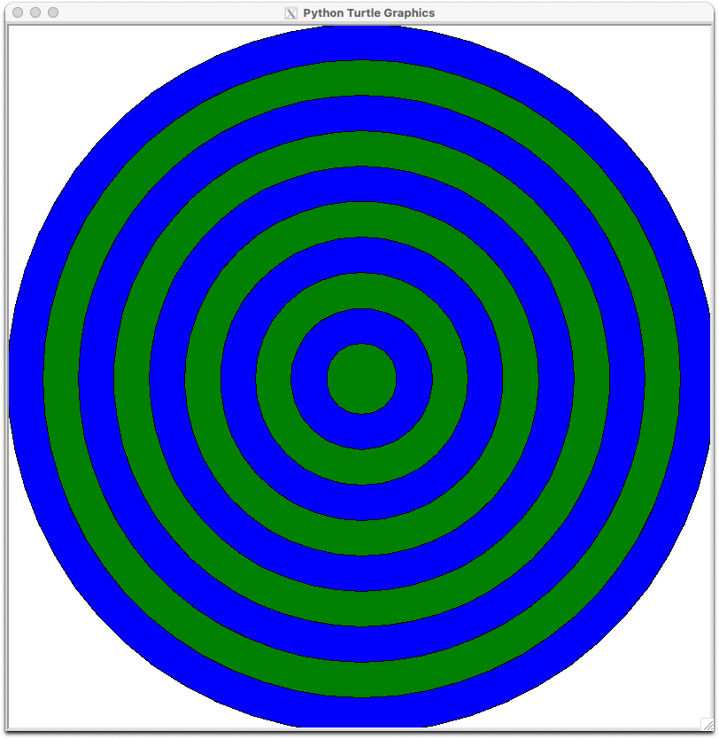
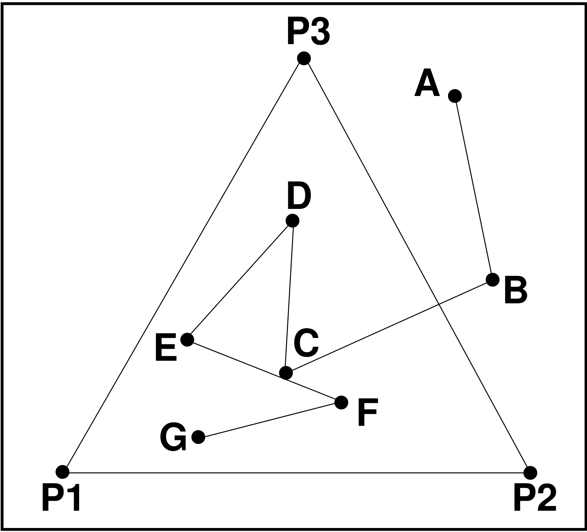
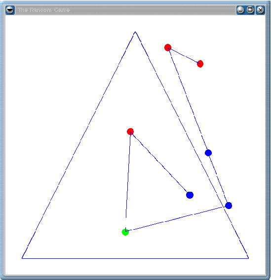
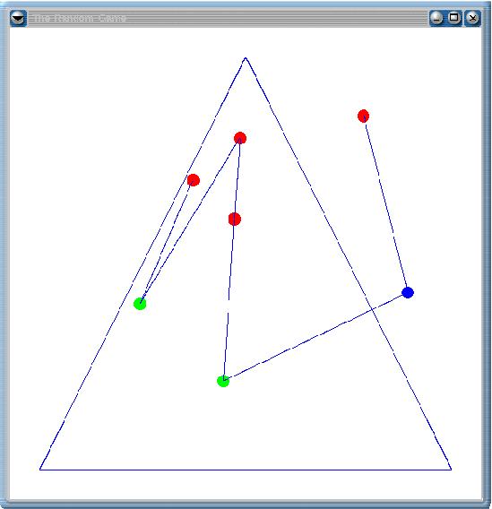
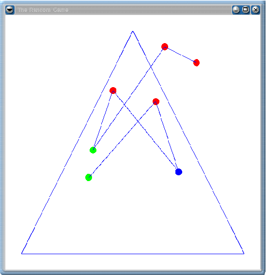
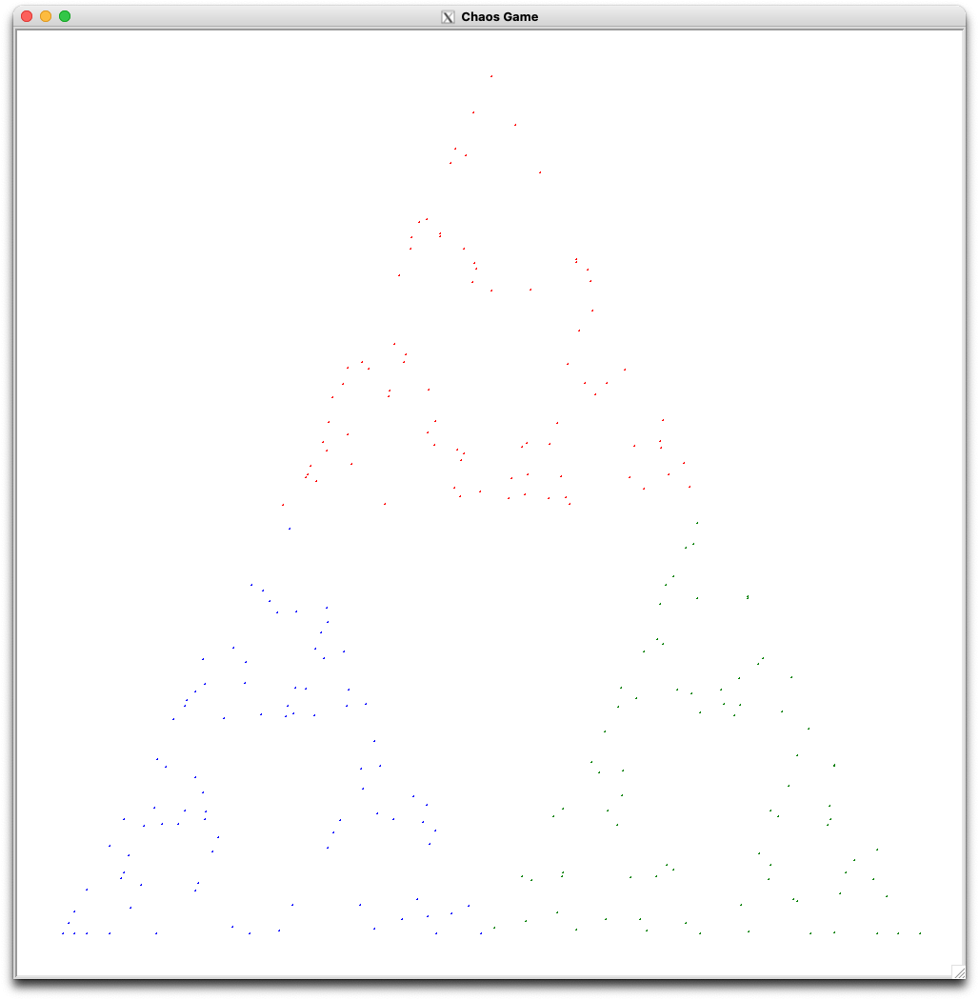

[](https://classroom.github.com/open-in-codespaces?assignment_repo_id=9964986)
# CSM2170-Lab03

 

## P01: Printing Stars

Complete [P01PrintingStars](P01PrintingStars.py) so that it prints `*` patterns of the form:

```ASCII
*
**
* *
*  *
*   *
******
```

If `height` is 0 then no triangle should be printed (not even a new line). Otherwise, the last line of the triangle
should have a new line at the end of it. This project can be harder than it first appears. Think about printing the
triangle in parts, top line, middle, and bottom line. For small heights not all parts need to be printed. If they
exist, the top line has just one star, the middle lines have a star some number of spaces (maybe 0) then another star,
and the bottom has a bunch of stars.

## P02: Approximate Pi

Complete [P02ApproximatePi](P02ApproximatePi.py) so that it approximates $\pi$ by accumulating a given
number of terms of:

$$\frac{\pi}{2} = \frac{2}{1} \times \frac{2}{3} \times \frac{4}{3} \times \frac{4}{5} \times \frac{6}{5}
\times \frac{6}{7}\times \frac{8}{7} \times \frac{8}{9} \times \cdots$$

## P03: Digit Sum

Complete [P03DigitSum](P03DigitSum.py) so that it outputs the sum of the digits of the integer entered.
The sum should ignore sign so `digit_sum(123)` and `digit_sum(-123)` are both 6. The program should keep
asking for integers until 0 is entered. 

### Hints
```python
# Assuming n is a positive integer, get the last digit of n
last_digit = n % 10

# Cut last digit from n
n = n // 10

# Another way of thinking about it is to use powers of 10 to get the ith digit.
digit = n // 10**i % 10
```

We can also use string manipulations to isolate the digits, but that uses Python features we have not talked about yet.

## P04: Maybe Finite

From a given starting positive number `n`, apply the following three rules to generate a sequence:

1. If `n` is even, `n = n // 2`
2. If `n` is odd, `n = n * 3 + 1`
3. If `n` is one stop, otherwise repeat.

Mathematicians believe sequences generated this way are finite i.e. for any starting `n` the sequence
will eventually terminate with a 1. However, there is currently no proof that such sequences are finite.

Complete [P04MaybeFinite](P04MaybeFinite.py) so that prompts the user for a starting `n`. and then prints
the sequence generated this way with a comma space between each term of the sequence. The sequence should end
with one new line after the last number.

## P05: Binary Dream

Complete [P05BinaryDream](P05BinaryDream.py) so that it outputs a random sequence of 0's, 1's, and spaces.
For each position of the sequence, 20% of the time a space is output. The other 80% of the time either a 0
or a 1 is output (with equal probability, i.e. 50% of the time it is a 0 if a space was not output). Note
your program should print no new lines. Most terminals will scroll when a line fills up, but many IDEs
will just show the sequence extending off to the side forever. Thus, to get the intended effect you should
run the program in a terminal. This program should use an infinite loop to print the never ending sequence
of 0's, 1's, and spaces. So, be sure you understand how to terminate a program to stop your program when
you are testing it. Note this program has no automated testing.

## P06: More Guessing

Complete [P06MoreGuessing](P06MoreGuessing.py) so that it plays the following guessing game.

* Pick a secret number between 100 and 999
* Let the user guess the number (at most 10 tries).
* If the user guesses the number, congratulate them and ask if they want to play again.
* If they have one or more digits in the correct location, let them know by printing
  `You have at least one digit that is correct and in the correct location.`
* Otherwise, if they have one or more digits that are correct
  print `You have at least one digit correct, but not in the correct location.`
* Otherwise, print `You have no correct digits.`
* If the user's tenth guess is incorrect, tell them they have lost the game, show them
  the secret number, and ask if they want to play again.

### Hints

See [P03: Digit Sum](#p03-digit-sum) for how to isolate digits of a number.


## P07: Nested Boxes

Use a loop (or loops) to complete [P07NestedBoxes](P07NestedBoxes.py) so a turtle draws 100 nested squares like in the following
picture.



Either keep the speed set to 0 or draw the image before opening the window (see the
[P09: Chaos Game](#hints) for details).

This project is based on Chapter 4 Programming Exercise 16. Note this program has no automated testing.

## P08: Circles

Use a loop (or loops) to complete [P08Circles](P08Circles.py) so a turtle draws nested circles like in the following picture.



The circles should start with a radius that just fits on the screen. Circles are filled with
alternating colors (of your choice, that are visible and distinct). The radius of the circles
decreases by 10% of the first radius. The process stops when the radius is less than 1.

Either keep the speed set to 0 or draw the image before opening the window (see the
[P09: Chaos Game](#hints) for details).

Note this program has no automated testing.

## P09: Chaos Game

Complete [P09ChaosGame](P09ChaosGame.py) so a turtle draws a picture with the following rules:

* Ask the user for a positive integer `n`
* Turn animation off, for _instant_ turtle moves (see hints for more details)
* Hide the turtle, so it draws, but the turtle icon does not get in the way (see hints for more details)
* Begin with a triangle with that has vertices `p1`, `p2`, and `p3`
* Assign colors to the vertices, e.g. `p1` is green}, `p2`
  is blue, and `p3` is red (you can pick colors you like as long as they are visible and visually distinct)
* Hide the turtle and pick the pen up
* For `n` turns
  + Randomly select a vertex (`p1`, `p2`, or `p3`)
  + Move the turtle _halfway_ to the selected vertex and make a dot of size 1 there the color of the
    selected vertex

Note this program has no automated testing. Try your program with some _large_ (but not too large) values
of `n`. You should see something interesting happen even though the process is random.

### Examples
Here is an example of a 7 move run of the Chaos Game. To make the example clear, no colors are shown, vertexes are
labeled, lines connect the moves, and the dots are larger.



Here are some more examples with colors, but with large dots and lines to make the path clear.







Remember for your solution you will not have lines connecting the dots, will have smaller dots, and will start in the
center of the triangle. Here is example output for `n = 250`, a dot size of 2, and
no connecting lines.



A dot size of 1 or 2 is a good size when you are done with this project. Larger sizes
and connecting lines will cause you to lose detail in the final image. However, when
you are debugging your project you may find larger sizes and lines will help. Just
be sure to set them back for your final version.

Test your program with `n = 100000` you should see the same distinct image every
time. Note that for such _large_ values of `n` it will take the turtle a few seconds
to draw (even with a tracer of 0).

### Hints

The following code assumes the turtle module has been imported and that `bob` is a turtle object, `screen`
is the name of a screen object, and `turtle` is the name of the module (i.e. not a turtle object).
```python
import turtle
screen = turtle.Screen()
bob = turtle.Turtle()
```

The size of the graphics window can be modified:
```python
screen.setup(800, 600)
```

You can give a title to the graphics window:
```python
screen.title("Chaos Game")
```

The size of a turtle's dot can be modified. Here is an example of drawing a dot of size 2:
```python
bob.dot(2)
```

Drawing a blue dot of size 5:
```python
bob.dot(5, 'blue')
```

We can query a turtle for its coordinates:
```python
current_x = bob.xcor()
current_y = bob.ycor()
```

We can create a new position and send a turtle to it:
```python
next_x = 100
next_y = 200
bob.setposition(next_x, next_y)
```

We can hide the turtle:
```python
bob.hideturtle()
```

We can display the graphics window after the turtle has finished drawing, which will speed up the
process:
```python
screen.tracer(0, 0) # stops animation
...
screen.update()   # displays graphics
```

To generate random integers:
```python
import random
rand_vertex = random.randint(1,3)
```

## Coding Style

Your code is not only graded by the automated tests. I will run more tests on
your code and review your code and commits. You are expected to follow good
programming conventions (see [Lab01](https://github.com/EIU-Computer-Science/CSM2170-Lab01)
for more details). Failure to do so will
impact your grade for an assignment. In particular, your code should pass the
linter checks, files should start with a docstring summarizing the project and
giving the names of the team members, and all functions should have a docstring
detailing their behavior.

## Submit your work by pushing it to GitHub

Commit your changes often (at least once per program, but likely many more
times for larger programs). Push when you are done with your work for the
day or have code that you want your partner or me to see. Until you push
your commits, they will only be on your local machine. Note that the
automated tests will run when you push as well. I will grade the last push
to the main branch that is done before the deadline. Commits or pushes done
after the deadline will receive no credit. Check that you can see your code
on GitHub before the deadline.

