
# Lab04

 

## Overview

Many of the projects for this lab have already been decomposed into functions
in the starter code. Pay attention to the requirements and return values
for each of these functions. Also, pay attention to how the projects have been
broken down into functions. In later labs, you will need to do this type of
decomposition yourself. You may add more functions if you wish, but you must
complete the requested functions as well.

Except for [P03EvenOrOdd](P03EvenOrOdd.py) you may assume that the user will
always enter valid input. For [P03EvenOrOdd](P03EvenOrOdd.py), you must handle
any string the user enters.

## P01: Ninety Nine Bottles

Ninety Nine Bottles is a folk song of unknown origin that is exceedingly repetitive. Complete the
functions outlined in [P01NinetyNineBottles](P01NinetyNineBottles.py) to make a program that generates
this annoying song. 

## P02: Monte Carlo Pi

A unit circle is a circle with radius 1 and area $\pi$. A unit square is a square with sides of length 1 and area 1.
Imagine inscribing a quarter-circle (with area $\frac{\pi}{4}$) inside a unit square and then randomly throwing darts
into the square. If we record how many darts fall within the quarter-circle, the ratio of the area of the
quarter-circle to the square can be approximated by the number of darts that fell within the quarter-circle to the
total number of darts thrown.

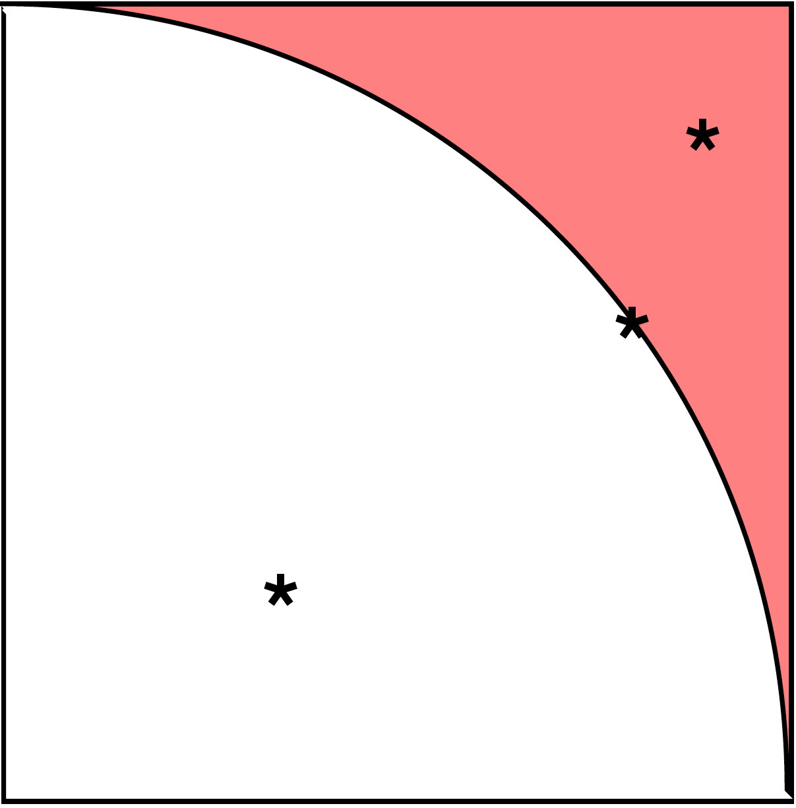

This yields a method for approximating $\pi$:

<pre>
Set counter to zero

Throw N darts
    If darts lands on or under circle
        counter = counter + 1

Approximation of Pi is 4 * (counter / N)
</pre>

Complete the functions outlined in [P02MonteCarloPi](P02MonteCarloPi.py) to make a program that approximates $\pi$ for
a given number of darts. Your program should make a table of the form:

<pre>
 darts | Estimate of pi | Error
 ------+----------------+---------
 10^1  | 2.400000       | 0.741593
 10^2  | 3.000000       | 0.141593
 10^3  | 3.200000       | 0.058407
 10^4  | 3.148400       | 0.006807
 10^5  | 3.149800       | 0.008207
 10^6  | 3.141856       | 0.000263
 10^7  | 3.141476       | 0.000116
 10^8  | 3.141896       | 0.000304
</pre>

Note that each row of the table will take 10 times longer to compute than the previous row. So the last row may take a
minute or two to compute (this is not a very efficient way to compute $\pi$). While slow, it does work and more
importantly, it is a good practice for loops, random numbers, and Monte Carlo methods.

## P03: Even or Odd

Complete the program [P03EvenOrOdd](P03EvenOrOdd.py) to play a dice game where the user guesses if the sum of
two dice will be even or odd. Your program should:

* Prompt the user for their guess
* Roll two dice
* Print the sum of the dice
* Print if the user guessed correctly
* Print the number of times the user has guessed correctly so far
* Repeat until the user quits

This program has limited automated testing. So you will need to manually test your program.
Note you must handle any string the user enters for this project.

## P04: Random Walk

For this project you will be completing the turtle graphics program [P04RandomWalk](P04RandomWalk.py).
This program will trace a random walk of a turtle. The turtle will start at the center of the window and
will continue to take steps in a random direction (up, down, left, or right) until the turtle steps outside
the window, or it returns to the origin (the center of the window). 

An example of a random walk that terminates quickly with the turtle returning to the origin:

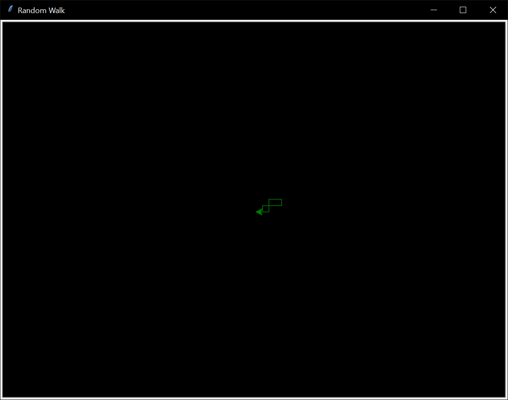

An example of a random walk that terminates when the turtle steps outside the window:

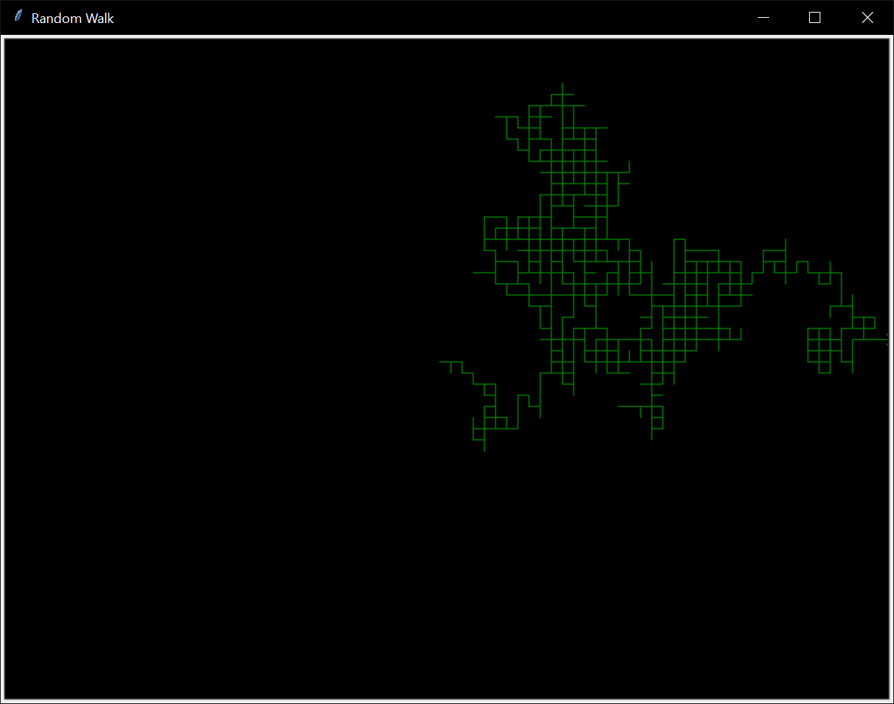

### Hints

* Turtles have a distance method that returns the distance between the turtle and the origin.
* A walk may stop quickly or take a long time. So be sure you know how to stop a program when running in your IDE or 
  from the command-line.
* Use a fencepost loop to ensure the turtle takes at least one step in the `walk`
  function.
* Unit tests are not provided for the `take_step` and `walk` functions. So you will have to test by hand. However, you
  can show me your program in lab, and I will tell you if your graphics are correct.

## P05: Line Pattern

For this project you will be completing the turtle graphics program [P05LinePattern](P05LinePattern.py)
to draw patterns of lines. Your program will start by prompting the user for the number of lines to be
drawn in each side of the pattern. One side of the pattern will have lines that are drawn from the left
edge of the window to the bottom edge of the window. The lines will be evenly spaced down and across each
edge. For example here is the pattern for 4 lines on the left and bottom edges of the window:

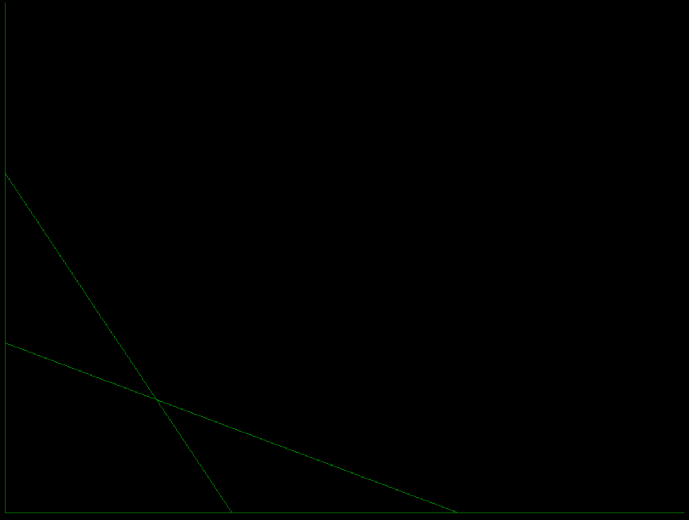

The first line connects the top left corner to the bottom left corner. The second line starts a third of the
way down the left edge and connects to the point a third of the way across the bottom edge. The third line
starts two thirds of the way down the left edge and connects to the point two thirds of the way across the
bottom edge. The fourth line starts in the bottom left corner and connects to the bottom right corner.

Note that the lines that connect corners of the window may not be visible. So add a small margin (space)
to your drawing so that all the lines are visible (approximately 5 pixels should be enough). Be sure that
you are drawing exactly the number of like that have been requested (no more and no less). Check for extra
lines by resizing the window by dragging the edges with your mouse.

This process is then repeated (reflected) for the other edges to create the following pattern:

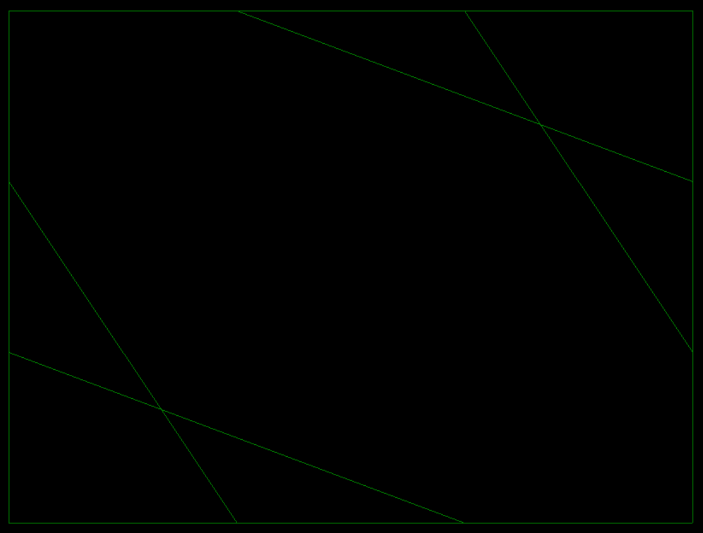

Here is the pattern for 10 lines:

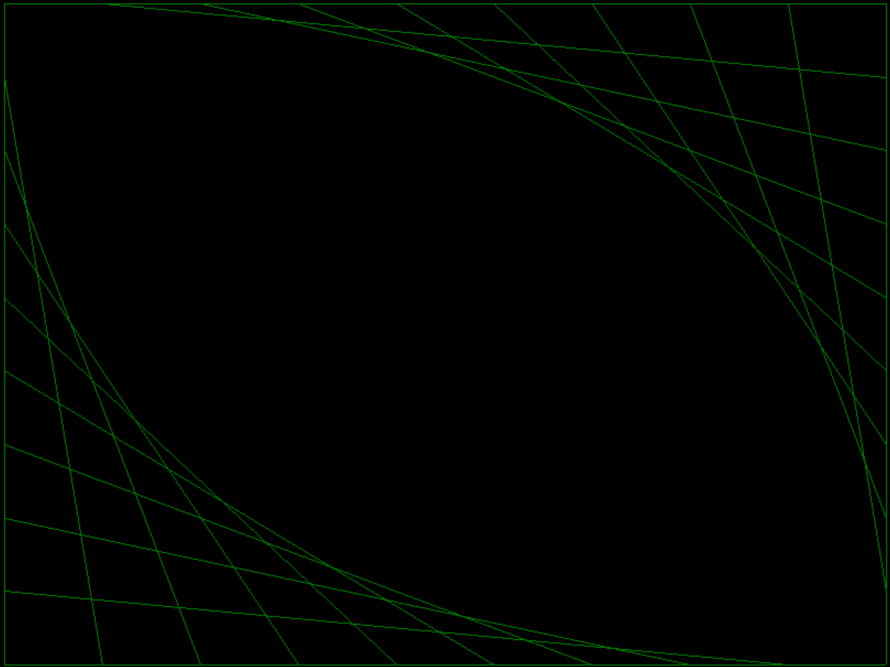

Here is the pattern for 50 lines being drawn:


### Hints

* All the lines have starting and ending points on the edge of the window. 
* Absolute moves (i.e. `goto()`) are the best way to draw these lines. Most of the time we will want to use relative
  moves (i.e. `forward()`, `backward()`, `left()`, `right()`) to draw lines. However, in this case we want to draw
  lines with endpoints that are always on the edges of the window. So absolute moves are the better choice. Be sure
  you understand the difference between absolute and relative moves and when to use each.
* Do not forget to use `penup()` when you want to move without drawing.
* The left and right patterns are reflections. So when you draw a line for one side you have all the
  information needed to draw the corresponding line on the other side.
* This project does not have automated testing. So you will have to test by hand. However, for all the graphics
  projects you can show me your programs in lab, and I will tell you if your graphics are correct. You should also gain
  confidence in your solutions by comparing your output to the given examples.

## P06: Checkers

For this project you will be completing the turtle graphics program [P06Checkers](P06Checkers.py) to draw
checkerboard patterns. Read the docstrings for each function carefully to be sure you understand what each function is
to do. Once you have completed the `draw_checker_square` and `draw_checker` functions, the starter code for
`draw_checkerboard` should draw:

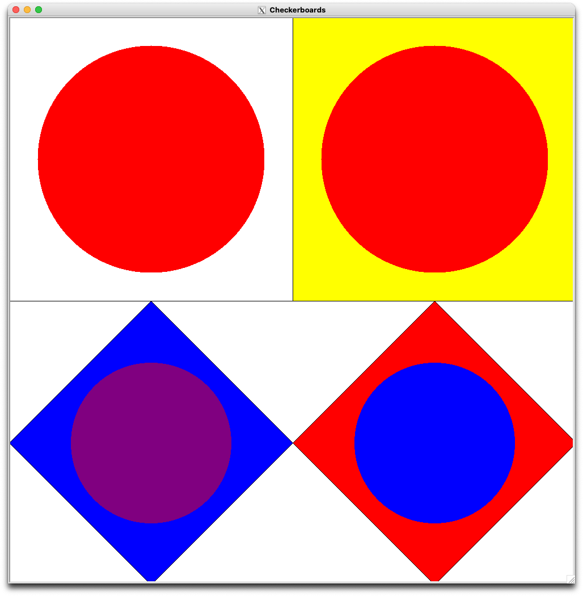

When all functions are correct the main function will draw the following checkerboard patterns.

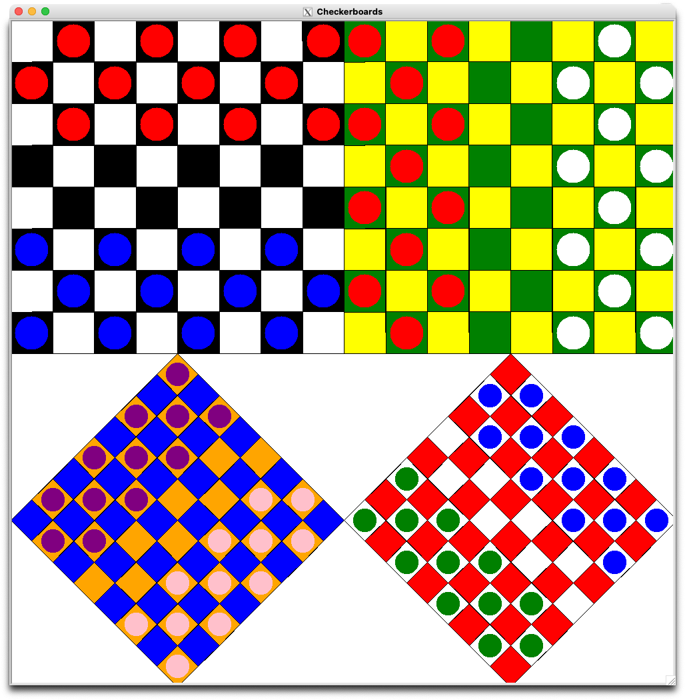

There is no automated testing for this project. The included main function will draw the test patterns for you
to check visually. Consider adjusting the `ANIMATION_ON`, `SPEED`, and `HIDE` constants to help debug your program.
Just be sure to set them back to the original values before submitting. I recommend completing the functions in order.

### Hint

You can get to the center of a square with two moves and one 90-degree turn of the turtle. In other words, you do not
have to move along the hypotenuse of a triangle, you can move along the legs. You can also move along the hypotenuse,
but then we would need to use the Pythagorean theorem to find the length of the move.

## P07: Pyramid

For this project you will be completing the turtle graphics program [P07Pyramid](P07Pyramid.py) to draw
pyramid patterns. Read the docstrings for each function carefully to be sure you understand what each function is
to do. Once you have completed the `random_color` and `fill_rectangle` functions, the starter code for
`draw_pyramid` should draw (with the upper left rectangle filled with a random color, i.e. one that
changes each time you run the program):

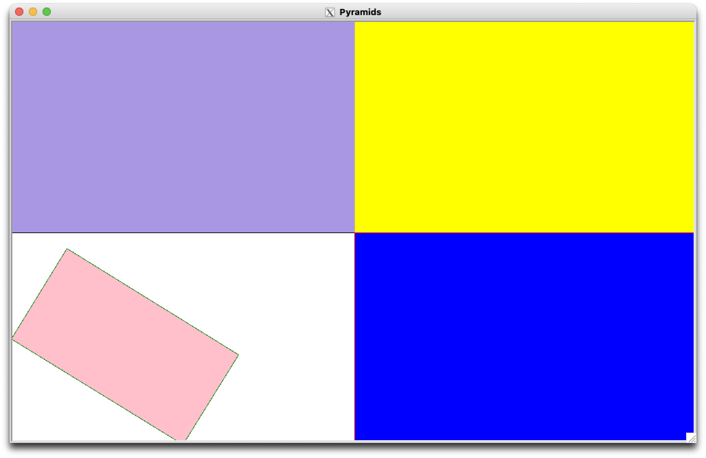

When all functions are correct the main function will draw the following pyramid patterns.

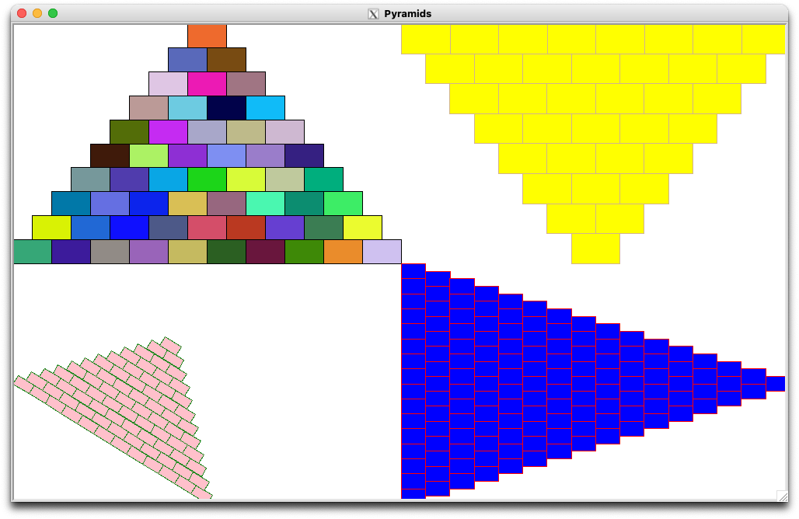

There is no automated testing for this project. The included main function will draw the test patterns for you
to check visually. Consider adjusting the `ANIMATION_ON`, `SPEED`, and `HIDE` constants to help debug your program.
Just be sure to set them back to the original values before submitting. I recommend completing the functions in order.   

## P08: More Stars

For this project you will be printing out patterns of asterisks, periods, and underscores. Here are the first 5
patterns (i.e. heights 1 to 5) with a blank line in-between (the blank line is not part of the pattern). The patterns
have no spaces.

<pre>
*

_*
***

__*
_*.*
*****

___*
__*.*
_*...*
*******

____*
___*.*
__*...*
_*.....*
*********
</pre>

You are to:
* Complete the function `print_stars(height)` so that it prints (not returns) the pattern with the given height (with no
  extra blank lines).
* Complete the function `main()` so asks the user for a height and then prints the pattern with that height. The
  `main` function should keep printing patterns until the user enters a number that is not positive. When the user does
   enter a non-positive number, print a goodbye message and stop.

## Coding Style

Your code is not only graded by the automated tests. I will run more tests on
your code and review your code and commits. You are expected to follow good
programming conventions (see [Lab01](https://github.com/EIU-Computer-Science/CSM2170-Lab01)
for more details). Failure to do so will
impact your grade for an assignment. In particular, your code should pass the
linter checks, files should start with a docstring summarizing the project and
giving the names of the team members, and all functions should have a docstring
detailing their behavior.

## Submit your work by pushing it to GitHub

Commit your changes often (at least once per program, but likely many more
times for larger programs). Push when you are done with your work for the
day or have code that you want your partner or me to see. Until you push
your commits, they will only be on your local machine. Note that the
automated tests will run when you push as well. I will grade the last push
to the main branch that is done before the deadline. Commits or pushes done
after the deadline will receive no credit. Check that you can see your code
on GitHub before the deadline.
