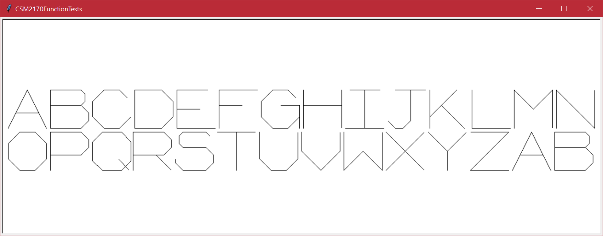
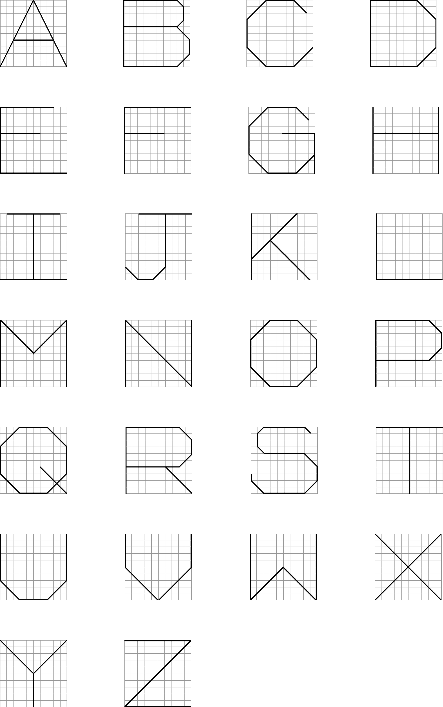
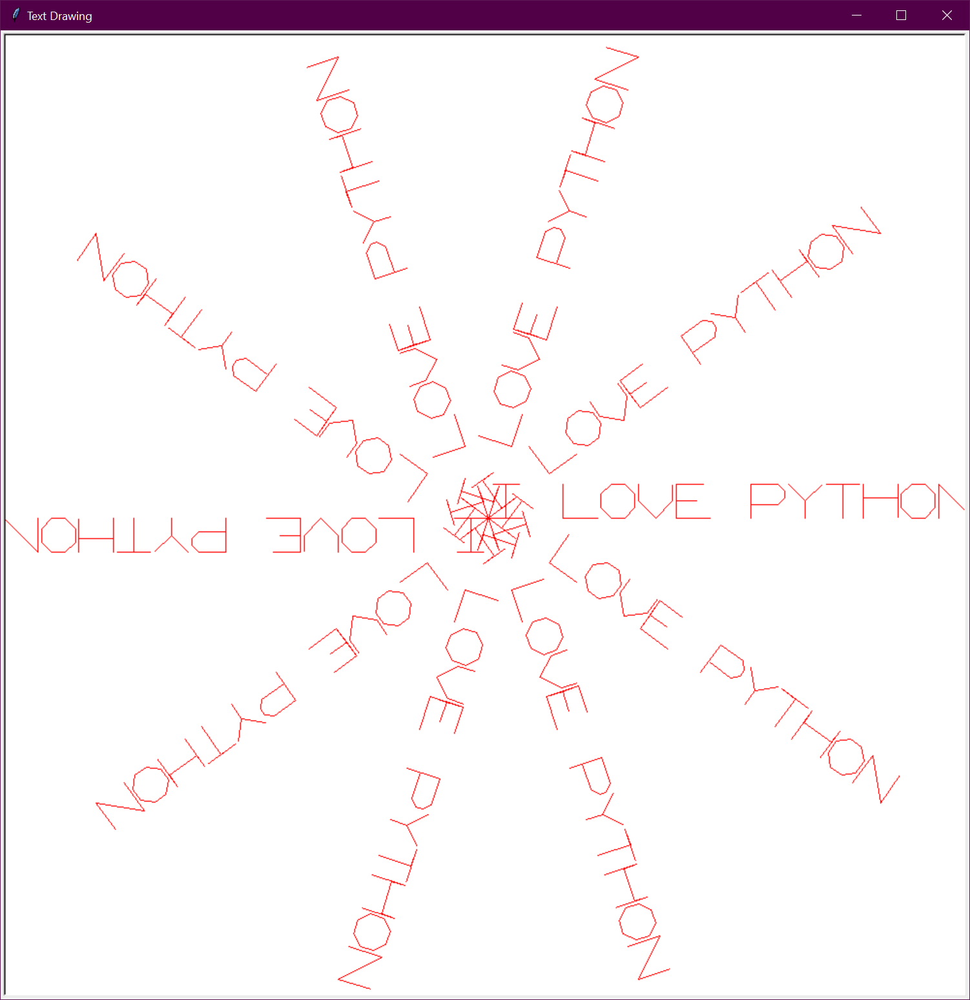
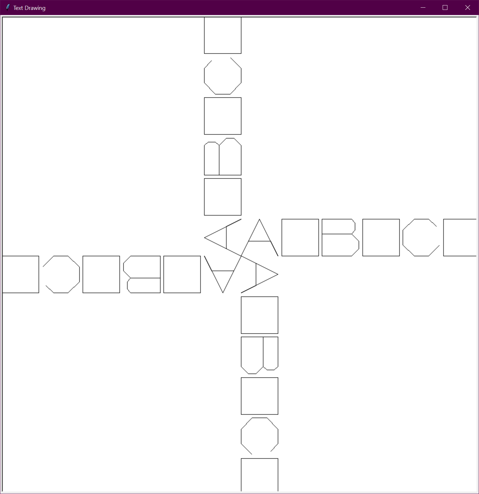
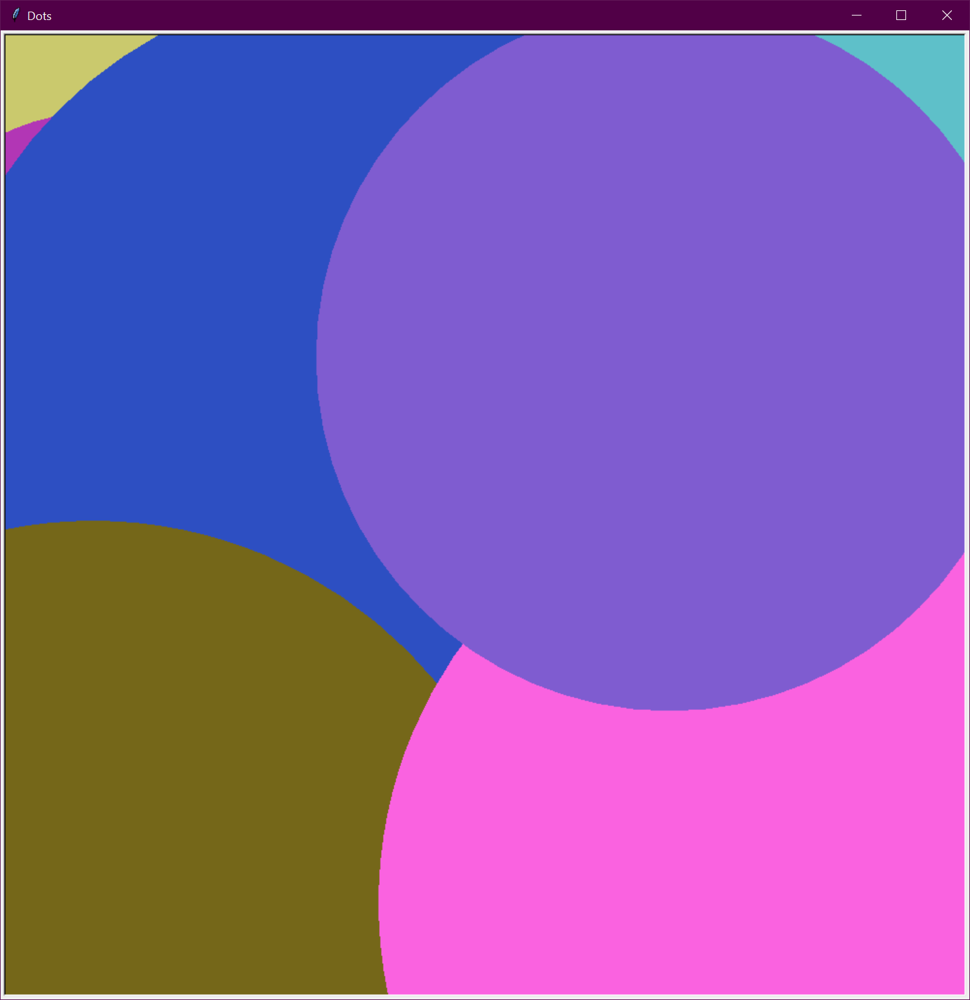
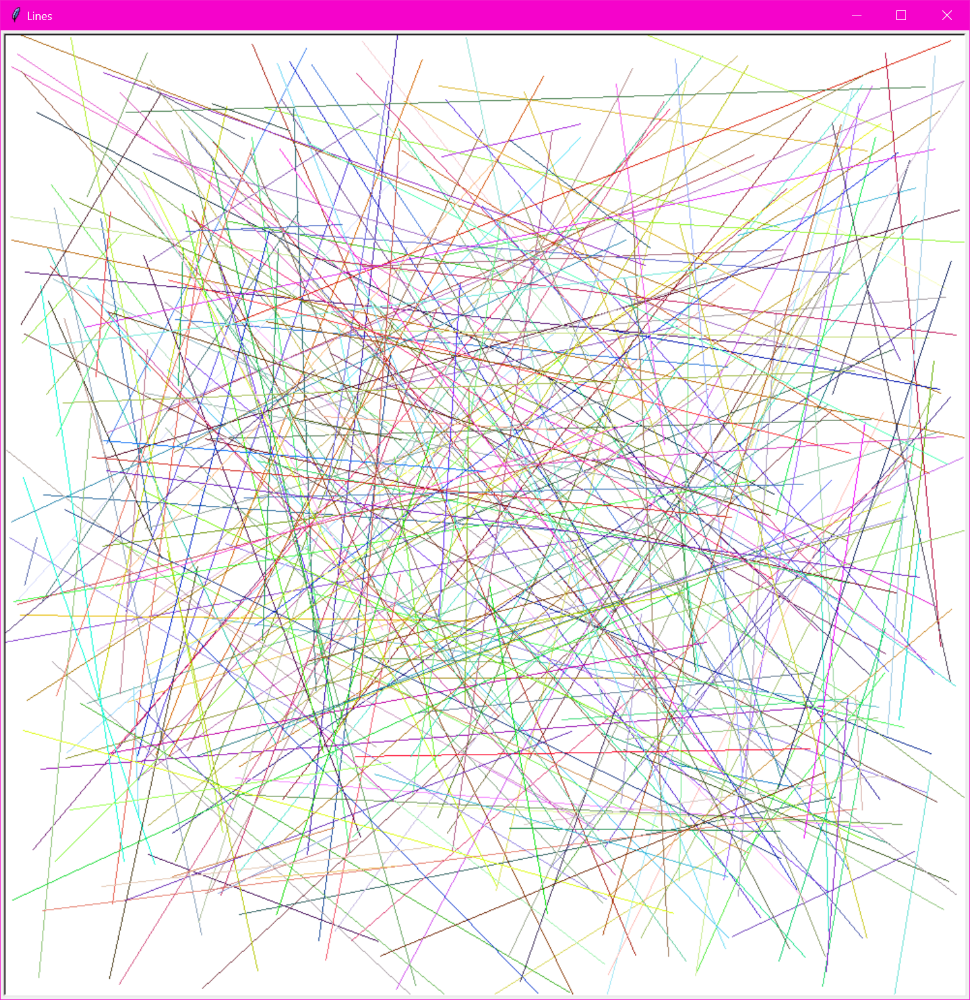
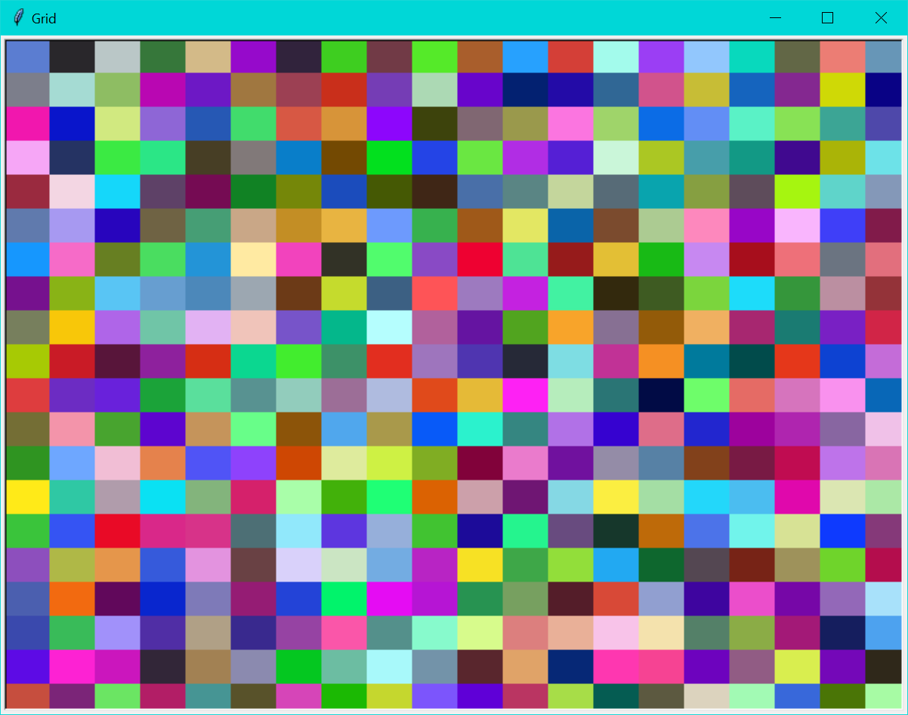

# Lab05

## Overview

Starting with this lab your will be responsible for more of the design of your solutions.
While I will still give requirements for some functions in many cases you will be designing most
of the solution. Remember to decompose your projects into functions and use good programming
practices. I will demo some solutions in class, so you can see the animations, but there are no automated tests for
this lab.

## Warning

If you are photosensitive, have epilepsy, or are otherwise sensitive to flashing lights, talk to me about alterations to
for some projects, as some of these programs cause random lights to flash on the screen. In any case, you should adjust
the timing of the projects, so they do not bother you.

## P01: Drawing Letters (20 points)
    
Complete the draw letter functions in the file `CSM2170Functions.py`. When complete the file
`P01DrawingLetters.py` should produce an image of the following form with the letters rotating about the center of the
image.

You are only editing `CSM2170Functions.py` not `P01DrawingLetters.py`. Show me your work during a lab check and I
will tell you if it is correct.

Each of the draw letter functions draws one letter that fits inside a square of the given size (the square is not
drawn). The turtle starts on the baseline of the letter ("bottom"), facing the direction the letter is to be drawn.
This baseline may or may not be parallel to any of the windows edges. When the function ends the turtle must be in the
same state it was in when the function was called (you can use the save and restore functions to help with this or move
the turtle back there yourself).

Your letters do not have to look exactly like the example. As long as they are visually recognizable as the correct
letter and touch each side of the bounding box they are given to fit inside, you will receive full credit. This is the one time you may use magic numbers in your code as some letters need
a few values to be tweaked to look right. Be sure that your letters are correct for all sizes (i.e. do not assume any
particular size). 

Because of its size, this project is worth more points than the others.

### Hints

* You are only making one version of each letter (all upper case). In other words, you do not need to make a lower case
  version for the letters.
* Start each function by calling `save_turtle_state` and end each function by calling `restore_turtle_state`. This will
  ensure that the turtle ends in the same state as it started.
* Draw with relative movements (e.g. `forward` and `backward`) rather than absolute movements (e.g. `goto`).
* Use relative turns (e.g. `left` and `right`) rather than absolute turns (e.g. `setheading`).
* Do not use fixed sizes for movements. Use percentages of the size parameter or other calculations based on the size
  parameter.
* Draw your letters on paper first. This will help you figure out how to draw them with turtle.
* Make your letters out of straight lines. This will make it easier to draw them with turtle.
* Test your work as your go. Each draw letter function you finish should add a new letter to the image in
  `P01DrawingLetters.py`.
* Divide the work with your partner. Avoid merge conflicts by only working on different functions.

### Letter Guide

Here is an example of each letter I made on a 10 by 10 grid.

## P02: Drawing Strings (10 points)

Complete the `draw_letter(my_turtle, letter, size)` and `draw_string(my_turtle, s, size)` functions in
the file `CSM2170Functions.py`. When complete `draw_string` should draw all the letters in the given
string `s` where each letter fits inside a square with side length `size`. Each letter should be
separated by a space of length `0.1 * size`. Any spaces in the string should be left as spaces in the
drawing. Any other non-letter characters should appear as a square (i.e. draw the square the character
would be in).

Use your `draw_string` function and other functions complete `P02DrawingStrings.py`. This program should:

* Prompt the user for a string.
* Prompt the user for a number, `n`.
* Prompt the user for a color.
* Draw the string `n` times in the given color in a circular pattern. The size should be chosen so that the
string just fits inside the window no matter how long it is.

Here is an example of the program drawing `I Love Python` 10 times in red.

Here is an example of the program drawing `a1b2c3` 4 times in black.

### Hints

* There is no animation in this program. Just draw the requested string `n` times, where `n` is given by the user.
* Make other functions to help you complete this project. For example, a function that computes the
  letter size to ensure a string fits on the screen.
* Use `draw_sqaure` to draw the square for non-letter characters.
* Use a loop over the string to draw each letter.

## P03: Dots (10 points)

Complete `P03Dots.py`. This program should draw random dots on the screen. The dots should be drawn in random locations,
with random sizes (between 1 and minimum of the width and height of the window), and random colors. The program should
keep drawing dots until it is closed.

Here is an example of the program after it has been running for a while.

### Hints

* Use `screen.colormode(255)` so you can use random RGB triples to specify colors
* Use `screen.tracer(0)` to turn off animation and then use `screen.update()` to update the screen after each dot is
  drawn.
* Use `sleep` from the `time` module to pause between dots. This will allow you to see the dots being drawn and will
allow you to control the speed at which the dots are drawn.
* If you are photosensitive, have epilepsy, or are otherwise sensitive to flashing lights, be sure to have a long
  sleep between each `dot` or talk to me about other options for this program.
* Use an infinite loop to keep drawing dots until the program is closed.

## P04: Lines (10 points)

Complete `P04Lines.py`. This program should draw random line segments on the screen. The line should be drawn in random
locations with random colors. The program should keep drawing lines until it is closed.

Here is an example of the program after it has been running for a while.

## P05: Grid

Complete `P05Grid.py`. This program should ask the user for a grid size (using a dialog box, i.e. not `input`). Then it should break the
screen into a grid ofthat size, and fill each grid location with a random color. The program should keep changing the random colors for each
cell until it is closed. The grid should resize to fit the window when the window is resized.

Here is an example of the program after it has been running for a while.

### Hints

* While you should turn the tracer off, you should not need to use sleep as filling each cell should be slow enough to
see.
* Call `screen.update()` after each cell is filled.
* Use `screen.window_width()` and `screen.window_height()` to get the current window size.
* Do not assume the window and each cell is square.

## Coding Style

Your code is not only graded by the automated tests. I will run more tests on
your code and review your code and commits. You are expected to follow good
programming conventions (see [Lab01](https://github.com/EIU-Computer-Science/CSM2170-Lab01)
for more details). Failure to do so will
impact your grade for an assignment. In particular, your code should pass the
linter checks, files should start with a docstring summarizing the project and
giving the names of the team members, and all functions should have a docstring
detailing their behavior.

## Submit your work by pushing it to GitHub

Commit your changes often (at least once per program, but likely many more
times for larger programs). Push when you are done with your work for the
day or have code that you want your partner or me to see. Until you push
your commits, they will only be on your local machine. Note that the
automated tests will run when you push as well. I will grade the last push
to the main branch that is done before the deadline. Commits or pushes done
after the deadline will receive no credit. Check that you can see your code
on GitHub before the deadline.
