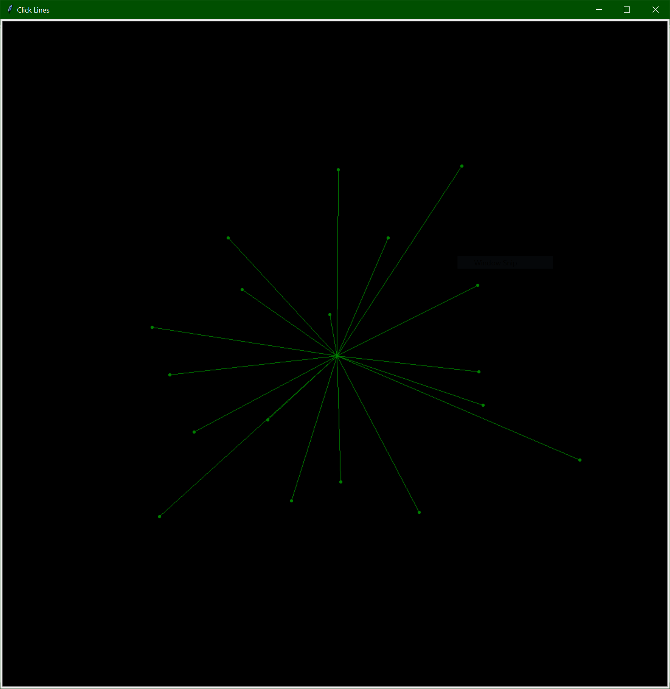
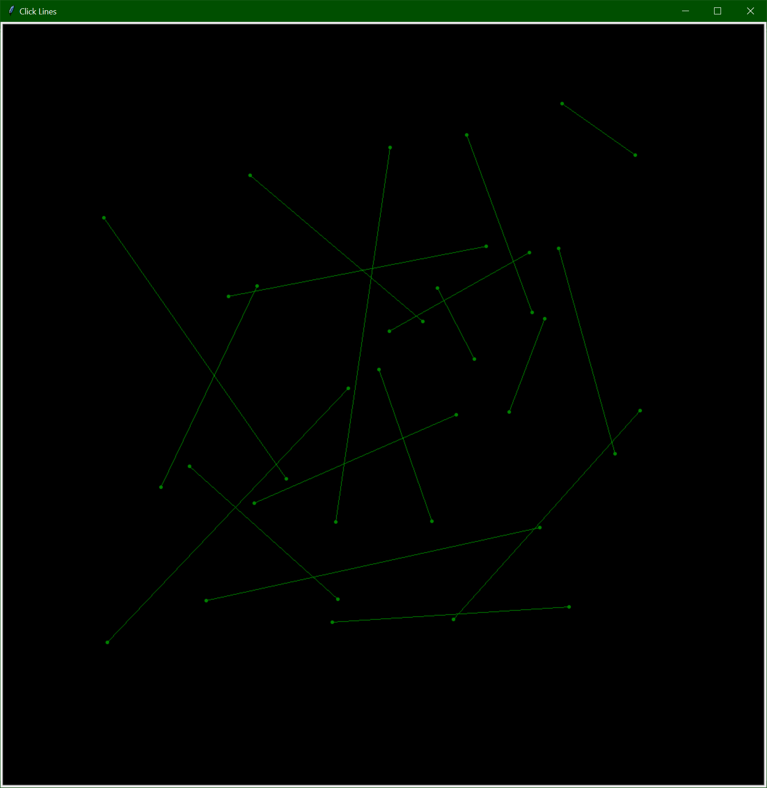
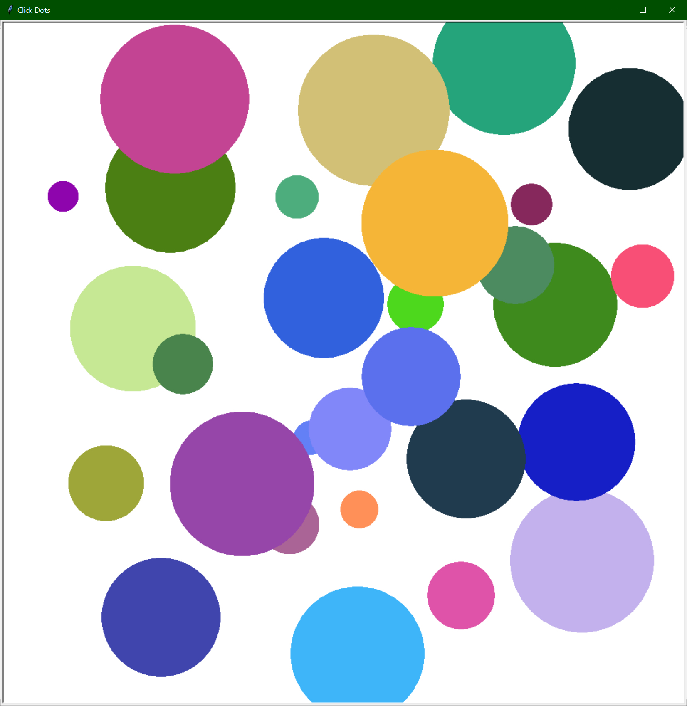
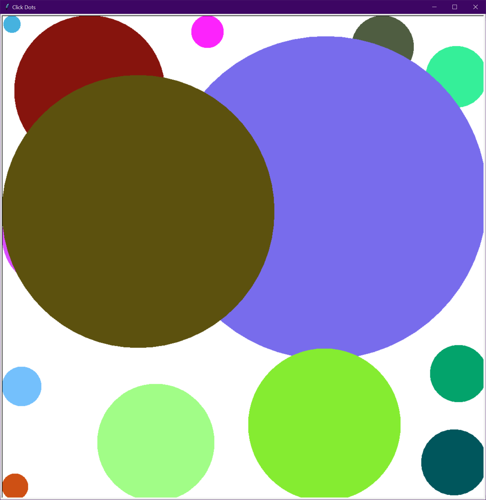
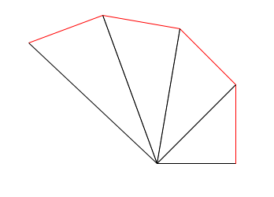
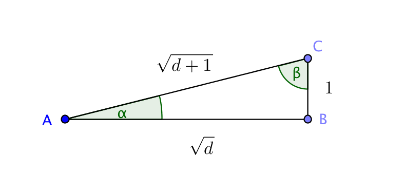

[](https://classroom.github.com/open-in-codespaces?assignment_repo_id=10550037)
# LabName

 

## P01: Click Lines (10 points)

The starting version of the program `P01ClickLines.py` draws a line segment from the center of the window to the point
where the user clicks (with dots drawn at both ends).



The program should be modified so that the line segment is drawn from the point where the user clicks to the point
where the user clicks again. That is, the first time the user clicks, a dot should be drawn at that point. The second
time the user clicks, a line segment should be drawn from the first click point to the second click point (with a dot
drawn at the second click point as well). The program then waits for the user to click again, and the process repeats.



This project is worth fewer points than the others.

### Hints

* Use a global variable(s) to keep track of the first click point.
* Use a sentinel value to indicate that the first click point has not yet been set (e.g., `None`).
* After the second click, set the sentinel value to indicate that the first click point needs to be set again.
* You can get the screen from a turtle object, e.g. `my_turtle.getscreen()`
* Another option for ClickLines is to have two different click handlers, one for the first click and one for the second. To replace a click handler use the add keyword argument. For example,

```python
# Replace any click handler with click_handler1
my_screen.onclick(click_handler1, add=False)
...
# Replace any click handler with click_handler2
my_screen.onclick(click_handler2, add=False)
...
# Remove all click handlers
my_screen.onclick(add=None) 
```

## P02: Click Dots (10 points)

The starting version of the program `P02ClickDots.py` draws a randomly colored dots of a random size where the user
clicks.



The program should be modified so that the dot touches at least one edge of the window. That is, the radius of the
dot should be exactly the distance from the click point to the nearest edge of the window. Note that your dot may
still be partially off the screen, as the borders of the windows are considered to be part of the window.



This project is worth fewer points than the others.

### Hints

* You do not need to use and should not use global variables.
* You only need to modify the `get_size` function.
* You may want to modify the `get_size` function to take the click location as a parameter.
* You can use Python's `min` function to find the minimum value of it's arguments, e.g. `min(1, 2, 3)`.  

## P03: Bounce Dots (15 points)

The starting version of the program `P03BounceDots.py` animates a dot moving from the center of the window to the
edge of the window. When the dot reaches the edge of the window it is moved back to the center of the window. You
are to modify the program so that the dot bounces off the edges of the window. If the dot hits the left edge the color
of the dot should change to "red", if the dot hits the right edge the color of the dot should change to "green", if
the dot hits the top edge the color of the dot should change to "blue", and if the dot hits the bottom edge the color
of the dot should change to "yellow", if the dot hits more than one edge the color should change to "purple". After
the dot has bounced off of 10 edges (hitting a corner counts as 2 hits) the dot should be moved back to the center of
the window and the color should be changed to "black".

### Hints

* I have posted another version of
  [ThrowingDots](https://github.com/EIU-Computer-Science/CSM2170-Examples/blob/main/M05/ThrowingDotsXY.py) on GitHub
  that shows another way of moving a dot with a velocity that is decomposed into its x and y components. This can
  simplify the math for bouncing off the walls. 
* When hitting the left or right edge, the x velocity should be negated.
* When hitting the top or bottom edge, the y velocity should be negated.
* When hitting a corner, both the x and y velocities should be negated.
* You can use trig functions to decompose the velocity vector (heading and speed) into x and y components. Or you can
  use global variables to keep track of the x and y components of the velocity vector. In this case, use `goto` to move
  the turtle instead of `forward` and ignore the heading of the turtle.
* Note `math.atan(ratio)` returns a value between $-\pi/2$ and $\pi/2$, while `math.atan2(y, x)` returns a value between
  $-\pi$ and $\pi$ (i.e. it covers the entire circle). Thus, `atan2` is almost always the version you want to use, if you
  have both the x and y components of a vector and want to find its direction.
* Remember to take into account the dot size when testing if the dot has hit a wall.
* You can change the dot's size and speed if you want as long as the changes are reasonable (i.e. does not detract from
  the animation).
* You use `math.radians(d)` to convert degrees into to radians and `math.degrees(r)` to convert radians into degrees. 

## P04: Craps (15 points)

You are to write a program that simulates the game of craps.

### The Dice Game "Craps"

* At the beginning of the game, the player rolls a pair of dice and computes the total
* If the total is 2, 3, or 12 (called **craps**), the player loses this round.
* If the total is 7 or 11 (called a **natural**), the player wins this round.
* If the total is any other number (4, 5, 6, 8, 9, or 10), that number becomes the **point**.
* From here, the player keeps rolling the dice until:
  + The **point** comes up again, in which case the player wins the round
  + Or a 7 comes up, in which case the player loses the round
* The numbers 2, 3, 11, and 12 have no special significance after the first roll.

### The Program

Your program should:

1. Ask the user if they would like to play.
2. Play one round of craps printing the results of each roll, what it means, and the final result of the round.
3. Print the number of wins and losses.
4. Go back to step 1.

For this project you must **not** use any global variables. You must use a main function and at least two other 
functions to encapsulate the logic and play of the game. In other words, you are to decompose the program into
functions.

## P05: Spiral (15 points)

Spirals have fascinated mathematicians for centuries. The Greek mathematician Theodorus of Cyrene
(5th century BC) is credited with such a spiral
([Spiral of Theodorus](https://en.wikipedia.org/wiki/Spiral_of_Theodorus)).
For this project, you will create a program to draw the Spiral of Theodorus with a specified number of
triangles. For example, here is the spiral with four triangles.



The basic building block of this spiral is a single right triangle, with legs of length
$\sqrt{d}$ and 1.  The Pythagorean Theorem tells us the hypotenuse
$\sqrt{(\sqrt{d})^2+1^2} = \sqrt{d+1}$.



Note you can compute the angles $\alpha$ and $\beta$ using inverse trigonometric
functions from the `math` module. 

Your program should:

1. Ask the user how many triangles of the spiral they would like drawn (use `numinput` to make a dialog box for this input).
2. Ask the user what color they would like the outer leg of the triangles to be (defaults to red if the user does
   not enter anything). Use `textinput` to make a dialog box for this input.
3. Asks the user what color they would like the other edges of the triangles to be (defaults to black if the user does not
   enter anything). Use `textinput` to make a dialog box for this input.
4. Draws the spiral with the specified number of triangles and colors.
5. Waits for the user to close the window.

For this project you must **not** use any global variables. You must use a main function and at least two other 
functions to encapsulate the logic and operation of the program. In other words, you are to decompose the program into
functions. Be sure to scale your window or scale your spiral so that the spiral fits in the window and
is a nice size for the window.

## P06: Square Roots (15 points)

The square root of $n$ can be approximated using the relationship:
$$x' = \frac{1}{2}\left(x + \frac{n}{x}\right)$$
and repeatedly replacing $x$ with $x'$, so for example the second iteration uses:
$$x'' = \frac{1}{2}\left(x' + \frac{n}{x'}\right)$$
and so on. Thus, $x$ (the approximation of the square root) is replaced by a new value during each
iteration over the formula. More iterations, means a closer approximation.

`P06SquareRoots.py` is to prompt for and get a value for $n$ and the number of iterations desired,
display the results:
* the approximation calculated by your program
* the square root of $n$ as calculated by the `math` module
* the error of the approximation with respect to the `math`  module
* then repeat if the user wishes to do so, otherwise halt.

### Functions

For this program, you will need to create at least the functions:

* `next_x(x, n)` which returns the new approximation based on the old value of $x$ and the value of the
given $n$

* `approximate_square_root(n, number_of_iterations)` which returns the approximation of $\sqrt{n}$ 
  found by iteratively applying the function `next_x` a total of `number_of_iterations` times,
  starting with $x=1$. If `number_of_iterations` is less than 1, this function should return 1.

* `ask_user()` which will ask the user if they wish to execute the program again, only allowing an
 answer of `y`, `n`, `yes`, or `no` regardless of capitalization.

## Coding Style

Your code is not only graded by the automated tests. I will run more tests on
your code and review your code and commits. You are expected to follow good
programming conventions (see [Lab01](https://github.com/EIU-Computer-Science/CSM2170-Lab01)
for more details). Failure to do so will
impact your grade for an assignment. In particular, your code should pass the
linter checks, files should start with a docstring summarizing the project and
giving the names of the team members, and all functions should have a docstring
detailing their behavior.

## Submit your work by pushing it to GitHub

Commit your changes often (at least once per program, but likely many more
times for larger programs). Push when you are done with your work for the
day or have code that you want your partner or me to see. Until you push
your commits, they will only be on your local machine. Note that the
automated tests will run when you push as well. I will grade the last push
to the main branch that is done before the deadline. Commits or pushes done
after the deadline will receive no credit. Check that you can see your code
on GitHub before the deadline.
